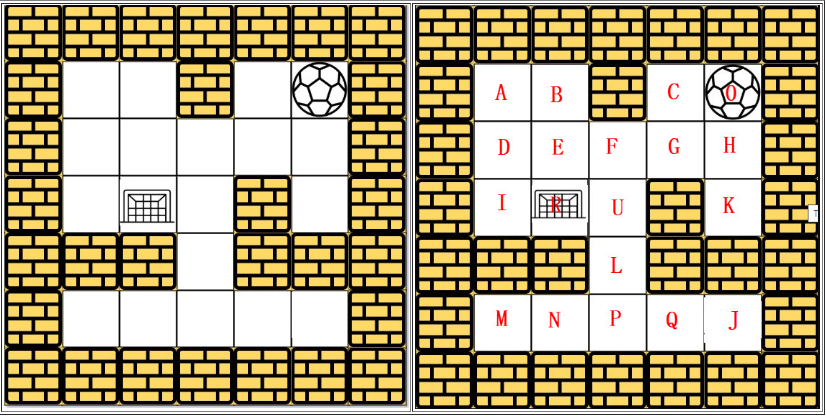

# Breadth-First Traversal: The Maze
## Description - Leetcode 490 The maze
There is a ball in a maze with empty spaces and walls. The ball can go through empty spaces by rolling up, down, left or right, but it won't stop rolling until hitting a wall. When the ball stops, it could choose the next direction.

Given the ball's start position, the destination and the maze, determine whether the ball could stop at the destination.

## Solution
The maze is represented by a binary 2D array. 1 means the wall and 0 means the empty space. You may assume that the borders of the maze are all walls. The start and destination coordinates are represented by row and column indexes.

BFS : find the shortest path

DFS : find one path

We will use BFS algorithm to solve the maze problem here.

## How to run it?
Way1: On Windows, copy the codes into your VSC editor. Click the 'run' button to run it.

Way2: On ubuntu, download the file maze_bfs.py into your working directory, run 'python3 bfs_maze.py' to run it.

## Presentation
[Breadth-First Traversal: The Maze](https://docs.google.com/presentation/d/1IxDKEYZMIFmObrPERAgaAxwmnGNR5qziqgttXQEamWU/edit?usp=sharing)
