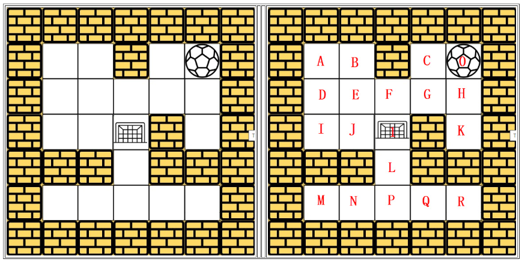
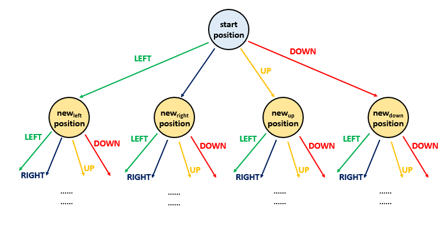

# The maze 

Solution:

Leetcode question description: 
https://leetcode.com/problems/the-maze/solution/

# Code: 
./Algorithm/MAZE/DFS/Python/maze.py

# How to run?
1. copy the source file to your directory: 
    copy ~/maze.py to your dir 
2. run python script file: 
    python3 maze.py

# Document(Google Slides): 
https://docs.google.com/presentation/d/1zgACbu8exgt_7LpzfhcodefNIrjv7ME2vFq8WphGoeg/edit?usp=sharing

